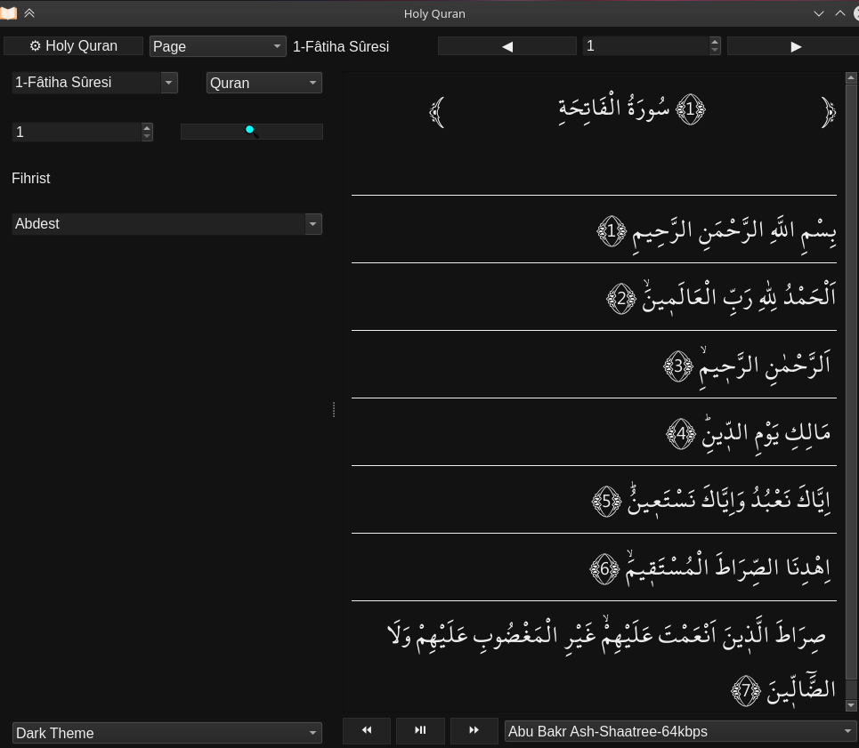

# ﷽
## Kuran-I_Kerim_app
Bu Kur'an-ı Kerim uygulaması

# bazı ekran görüntüleri





.


.


.


.


[Türkiye Cumhuriyeti Cumhurbaşkanlığı
Diyanet İşleri Başkanlığı Kur'an-ı Kerim dosyası](https://kuran.diyanet.gov.tr/Yayinlar)

# Running

`python3 main.py`

# Building

```console
sudo apt install devscripts git-buildpackage
sudo mk-build-deps -ir
gbp buildpackage --git-export-dir=/tmp/build/holy-quran -us -uc --git-ignore-branch --git-ignore-new
```

## İnşAllah bu özelliklere sahip
- Kur'an-ı Kerim ayetlerini okuyun ve veri tabanı oluşturun.**
- Birden Fazla imamla âyet okuma
- Sayfa veya ayet seçimi
- Sure ve ayet araması
- Sure görünümü iyileştirme

** jüpiter nootbok ve Kuran.txt ile aynı veri tabanını oluşturabilirsiniz ama ben sayfa numaralarını ve âyet bilgilerini başka bir veri tabanına ayırıyorum

##inşallah 
- Anahtar kelime, kelime ve cümle aranıyor
- Meal
- Tercüme


