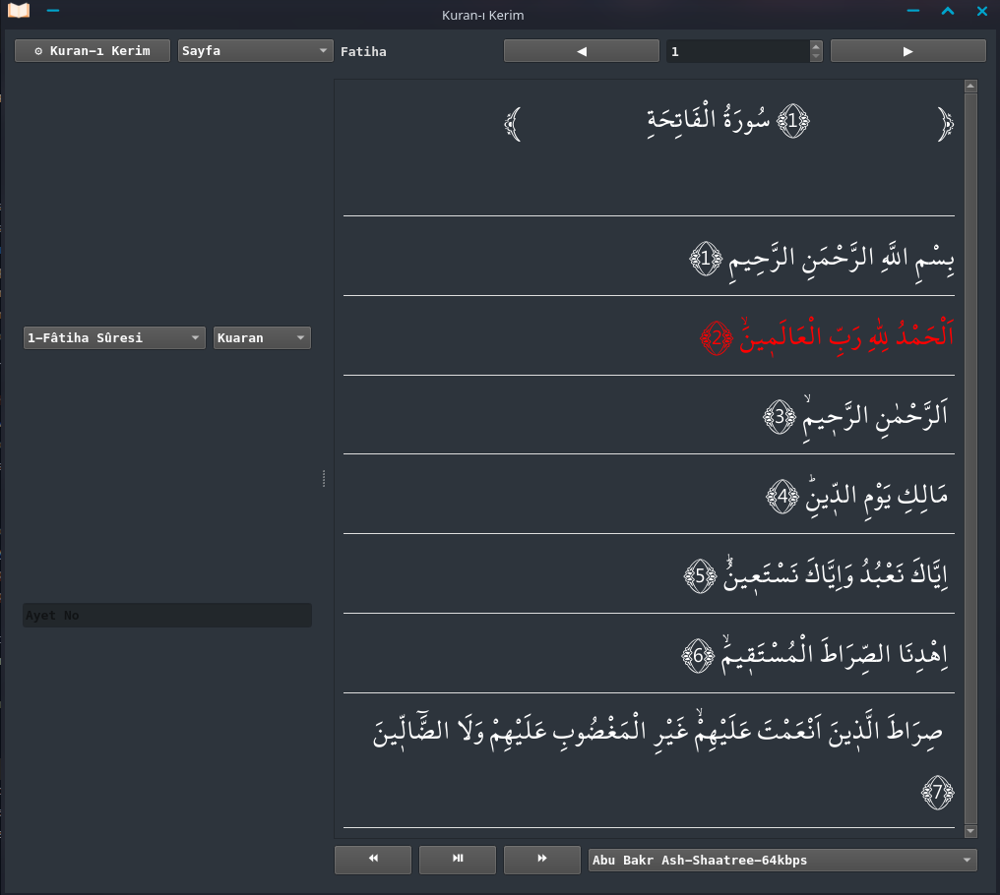
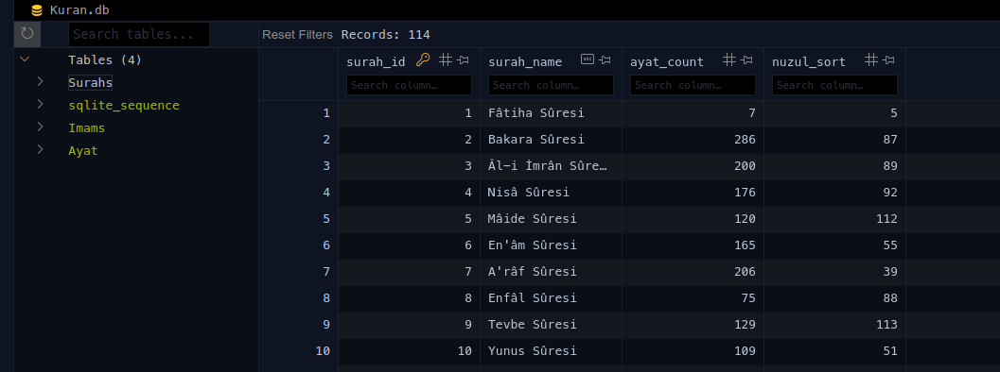
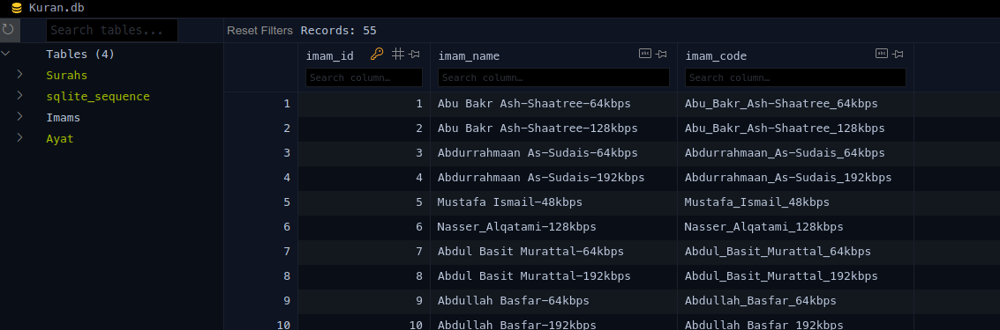
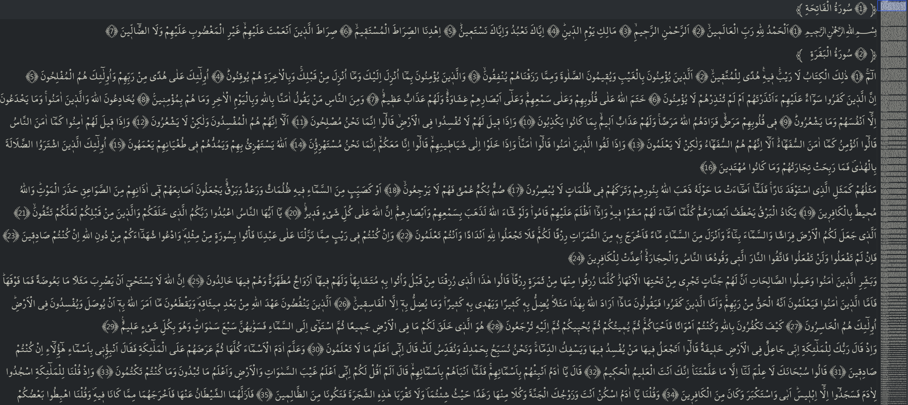

# ﷽
## Kuran-I_Kerim_app
It is Holy Quran app

# some screenshots




.



.


.



.




It uses [Presidency of the Republic of Türkiye
Presidency of Religious Affairs Noble Quran file](https://kuran.diyanet.gov.tr/Yayinlar)

# Running

`python3 main.py`

# Building

```console
sudo apt install devscripts git-buildpackage
sudo mk-build-deps -ir
gbp buildpackage --git-export-dir=/tmp/build/Holy_Quran -us -uc --git-ignore-branch --git-ignore-new


## InshAllah Now it has
- Sperate Noble Quran ayats and generate data base.**
- Playing ayats with a lot of Imams
- Choosing page or ayats
- Searching surah and ayat
- Surah view improvement

** you can generate same data base with jupiter nootbok and Kuran.txt but i take page numbers and secde ayats info another database

## InshAllah it will have
- Searching Keyword, word and senetence
- Meal
- Translation
