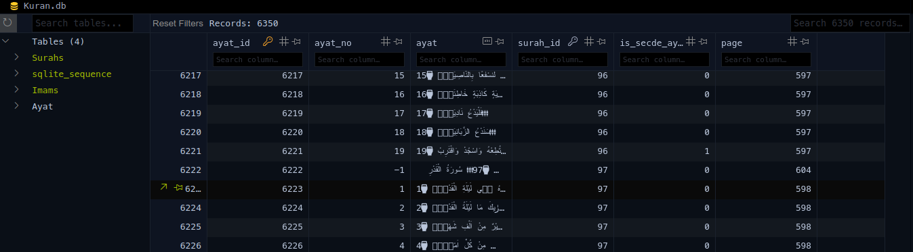

# ﷽
## Kuran-I_Kerim_app
It is Holy Quran app

# some screenshots

It uses [Presidency of the Republic of Türkiye
Presidency of Religious Affairs Noble Quran file](https://kuran.diyanet.gov.tr/Yayinlar)

Now it sperate Noble Quran ayats and generate data base.

InshAllah try to make a grafic user interface with read, listen and research application.